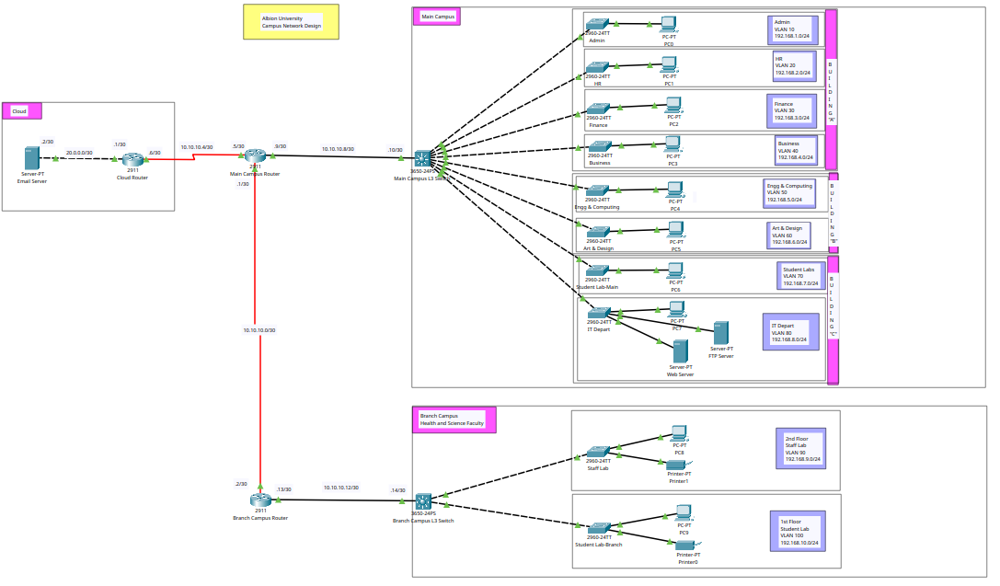

# Albion University - Campus Network Design
**Editing v1 (Router-on-a-Stick) Configuration to make L3-Switch SVI Intervlan Routing**

### Topology in Cisco Packet Tracer


### Requirement

1. Albion University has **two campuses** that are **20 miles apart**.
2. Main Campus: <br>
   - Building A <br>
    Departments:
      - Admin
      - HR
      - Finance 
    - Building B <br>
    Departments:
      - Engineering and Computing
      - Art and Design
    - Building C <br>
    Departments:
      - Student Lab
      - IT Department - has internal servers
3. Smaller Campus - Faculty of Health and Sciences
   - 2nd Floor - Staff Lab
   - 1st Floor - Student Lab

4. The email server is hosted externally in the cloud.
5. Each faculty has to be in different IP network.
6. Use RIPv2 for routing.
7. Configure DHCP for all devices in the campus.

## Steps
### Enabling Router Interfaces <br>
1. Main Campus Router
    ``` 
    int gig0/0
    no sh
    ```
2. Branch Campus Router
    ```
    int gig0/0
    no sh
    ```
3. Cloud Router
    ```
    int gig0/0
    no sh
    ```

### Serial Interfaces in Routers <br>
1. Main Campus Router<br>
    `Install HWIC-2T module in the router`
    ```
    int se0/1/0
    no sh
    clock rate 64000

    int se0/1/1
    no sh
    ```
2. Branch Campus Router<br>
    `Install HWIC-2T module in the router`
    ```
    int se0/1/0
    no sh
    clock rate 64000
    ```
3. Cloud Router <br>
    `Install HWIC-2T module in the router`
    ```
    int se0/1/0
    no sh
    ```

### Assigning IP to Router Interfaces
1. Main Campus Router
    ```
    int se0/1/0
    ip address 10.10.10.5 255.255.255.252
    no sh
    exit

    int se0/1/1
    ip address 10.10.10.1 255.255.255.252
    no sh
    exit
    ```
2. Branch Campus Router
    ```
    int se0/1/0
    ip address 10.10.10.2 255.255.255.252
    no sh
    exit
    ```
3. Cloud Router
    ```
    int se0/1/0
    ip address 10.10.10.6 255.255.255.252
    no sh
    exit

    int gig0/0
    ip address 20.0.0.1 255.255.255.252
    no sh
    exit
    ```

### Configure VLANs in all L2 Switches
1. Switch - Admin
    ```
    int range fa0/1-24
    switchport mode access
    switchport access vlan 10
    ```
2. Switch - HR
    ```
    int range fa0/1-24
    switchport mode access
    switchport access vlan 20
    ```
3. Switch - Finance
    ```
    int range fa0/1-24
    switchport mode access
    switchport access vlan 30
    ```
4. Switch - Business
    ```
    int range fa0/1-24
    switchport mode access
    switchport access vlan 40
    ```
5. Switch - Engineering and Computing
    ```
    int range fa0/1-24
    switchport mode access
    switchport access vlan 50
    ```
6. Switch - Arts and Design 
    ```
    int range fa0/1-24
    switchport mode access
    switchport access vlan 60
    ```
7. Switch - Student Labs
    ```
    int range fa0/1-24
    switchport mode access
    switchport access vlan 70
    ```
8. Switch - IT Depart
    ```
    int range fa0/1-24
    switchport mode access
    switchport access vlan 80
    ```
9. Switch - 2nd Floor - Staff Lab
    ```
    int range fa0/1-24
    switchport mode access
    switchport access vlan 90
    ```
10. Switch - 1st Lab - Student Lab
    ```
    int range fa0/1-24
    switchport mode access
    switchport access vlan 100
    ```

### Delete Sub-interfaces of Routers
1. Main Campus Switch
    ```
    no int gig0/0.10
    no int gig0/0.20
    no int gig0/0.30
    no int gig0/0.40
    no int gig0/0.50
    no int gig0/0.60
    no int gig0/0.70
    no int gig0/0.80
    ```
2. Branch Campus Router
    ```
    no int gig0/0.90
    no int gig0/0.100
    ```

### Delete DHCP Pools of Routers
1. Main Campus Router
    ```
    no ip dhcp pool Admin-Pool
    no ip dhcp pool HR-Pool
    no ip dhcp pool Finance-Pool
    no ip dhcp pool Business-Pool
    no ip dhcp pool EnC-Pool
    no ip dhcp pool AnD-Pool
    no ip dhcp pool Student-Lab-Pool
    no ip dhcp pool IT-Depart-Pool
    ```
2. Branch Campus Router
    ```
    no int gig0/0.90
    no int gig0/0.100
    ```

### Enable Routing in L3 Switch
1. Main Campus L3 Switch
    ```
    ip routing
    ```
2. Branch Campus L3 Switch
    ```
    ip routing
    ```

### Create SVIs in L3 Switches for each VLAN
1. Main Campus L3 Switch
    ```
    int vlan 10
    ip address 192.168.1.1 255.255.255.0
    no sh

    int vlan 20
    ip address 192.168.2.1 255.255.255.0
    no shn

    int vlan 30
    ip address 192.168.3.1 255.255.255.0
    no sh

    int vlan 40
    ip address 192.168.4.1 255.255.255.0
    no sh

    int vlan 50
    ip address 192.168.5.1 255.255.255.0
    no sh

    int vlan 60
    ip address 192.168.6.1 255.255.255.0
    no sh

    int vlan 70
    ip address 192.168.7.1 255.255.255.0
    no sh

    int vlan 80
    ip address 192.168.8.1 255.255.255.0
    no sh
    ```
2. Branch Campus L3 Switch
    ```
    int vlan 90
    ip address 192.168.9.1 255.255.255.0
    no sh

    int vlan 100
    ip address 192.168.10.1 255.255.255.0
    no sh
    ```

### Configuring DHCP in L3 Switch
1. Main Campus L3-Switch
    ```
    service dhcp

    ip dhcp pool Admin-Pool
    network 192.168.1.0 255.255.255.0
    default-router 192.168.1.1
    dns-server 192.168.1.1
    domain-name admin.com

    ip dhcp pool HR-Pool
    network 192.168.2.0 255.255.255.0
    default-router 192.168.2.1
    dns-server 192.168.2.1
    domain-name hr.com

    ip dhcp pool Finance-Pool
    network 192.168.3.0 255.255.255.0
    default-router 192.168.3.1
    dns-server 192.168.3.1
    domain-name finance.com

    ip dhcp pool Business-Pool
    network 192.168.4.0 255.255.255.0
    default-router 192.168.4.1
    dns-server 192.168.4.1
    domain-name buniness.com

    ip dhcp pool EnC-Pool
    network 192.168.5.0 255.255.255.0
    default-router 192.168.5.1
    dns-server 192.168.5.1
    domain-name enc.com

    ip dhcp pool AnD-Pool
    network 192.168.6.0 255.255.255.0
    default-router 192.168.6.1
    dns-server 192.168.6.1
    domain-name and.com

    ip dhcp pool Student-Lab-Pool
    network 192.168.7.0 255.255.255.0
    default-router 192.168.7.1
    dns-server 192.168.7.1
    domain-name and.com

    ip dhcp pool IT-Depart-Pool
    network 192.168.8.0 255.255.255.0
    default-router 192.168.8.1
    dns-server 192.168.8.1
    domain-name itdepart.com
    ```
2. Branch Campus L3-Switch
    ```
    service dhcp

    ip dhcp pool Staff-Lab-Pool
    network 192.168.9.0 255.255.255.0
    default-router 192.168.9.1
    dns-server 192.168.9.1
    domain-name stafflab.com

    ip dhcp pool Student-Lab-Pool
    network 192.168.10.0 255.255.255.0
    default-router 192.168.10.1
    dns-server 192.168.10.1
    domain-name studentlab.com
    ```

### Make Routed Port in L3 Switch
1. Main Campus L3 Switch
    ```
    int gig1/0/1
    no switchport
    ip address 10.10.10.10 255.255.255.252
    no sh
    ```
2. Branch Campus L3 Switch
    ```
    int gig1/0/3
    no switchport
    ip address 10.10.10.14 255.255.255.252
    no sh
    ```

### IP to Router Interface
1. Main Campus Router
    ```
    int gig0/0
    ip address 10.10.10.9 255.255.255.252
    no sh
    ```
2. Branch Campus Router
    ```
    int gig0/0
    ip address 10.10.10.13 255.255.255.252
    no sh
    ```


### Make L3-----L2 Interface as Trunk
1. Main Campus
    - L3-Switch
        ```
        interface gig1/0/2
        switchport mode trunk
        switchport trunk allowed vlan 10
        ex
        ```
        *Similar for other interfaces of L3-Switch gig1/0/3-9* <br>

    - L2-Switches
        ```
        en
        config t
        interface fa0/1
        switchport mode trunk
        switchport trunk allowed vlan 10
        ex
        do wr
        ```
        *Similar in other L2-Switches* <br>

2. Branch Campus
    - L3-Switch
        ```
        en
        config t
        interface gig1/0/1
        switchport mode trunk
        switchport trunk allowed vlan 90
        ex
        ```
        *Similar for other interfaces of L3-Switch gig1/0/2* <br>

    - L2-Switches
        ```
        en
        config t
        interface fa0/1
        switchport mode trunk
        switchport trunk allowed vlan 100
        ex
        do wr
        ```
        *Similar in other L2-Switches*


### RIPv2 on L3-Switch
1. Main Campus L3-Switch
    ```
    ip routing
    router rip
    version 2
    no auto-summary
    network 10.10.10.8
    network 192.168.1.0
    network 192.168.2.0
    network 192.168.3.0
    network 192.168.4.0
    network 192.168.5.0
    network 192.168.6.0
    network 192.168.7.0
    network 192.168.8.0
    ```
2. Branch Campus L3-Switch
    ```
    ip routing
    router rip
    version 2
    no auto-summary
    network 10.10.10.12
    network 192.168.9.0
    network 192.168.10.0
    ```

### RIPv2 on Router
1. Main Campus Router
    ```
    router rip
    version 2
    no auto-summary
    network 10.10.10.0
    network 10.10.10.4
    network 10.10.10.8
    ```
2. Branch Campus Router
    ```
    router rip
    version 2
    no auto-summary
    network 10.10.10.0
    network 10.10.10.12
    ```
### ~~Configuring Trunk Interfaces in L3-Switch~~

### ~~Sub-interfaces on Router~~
